# Drizzle ORM: The Complete Beginner's Guide

Welcome to the technical documentation for Drizzle ORM. This guide is designed to take you from zero knowledge to understanding exactly how Drizzle works, how files are generated, and how your database interacts with your code.

---

## 1. Core Concepts

Before writing code, it is essential to understand the terminology. Think of building a database like building a house.

### 🏗️ Drizzle ORM (The "Smart Home System")
**Drizzle ORM** is the library you use inside your application code (e.g., Next.js API routes). It allows you to talk to your database using TypeScript instead of raw SQL.
*   **Role:** Runtime interaction (Selecting, Inserting, Updating data).
*   **Analogy:** You press a button on your phone ("Get User"), and the system handles the wiring to turn on the lights.

### 🧰 Drizzle Kit (The "Construction Crew")
**Drizzle Kit** is a Command Line Interface (CLI) tool used during development. It does not run in your live application. Its job is to manage the structure of your database.
*   **Role:** Development tasks (Generating SQL, pushing changes to the DB).
*   **Analogy:** The construction crew that reads your blueprints and builds the walls.

### 📜 Schema (The "Blueprint")
The **Schema** (`schema.ts`) is a TypeScript file where you define your data structure (tables, columns, types).
*   **Analogy:** The architectural blueprint. It says, "There should be a kitchen here," but it isn't the actual kitchen yet.

### 🚧 Migrations (The "Instructions")
**Migrations** are SQL files generated by Drizzle Kit based on your schema. They serve as a history log of changes.
*   **Analogy:** Step-by-step instructions for the builder.
    *   *Migration 1:* "Pour the foundation."
    *   *Migration 2:* "Add a window."

---

## 2. The Architecture & Flow

Understanding how data flows from your code to the database is critical.

### Visual Flowchart

```mermaid
flowchart TD
    subgraph Developer_Zone ["💻 Developer Zone"]
        Schema["schema.ts<br/>(Your Blueprint)"]
        Config["drizzle.config.ts<br/>(Tool Settings)"]
    end

    subgraph Drizzle_Kit ["🧰 Drizzle Kit (CLI)"]
        CmdGen["Command: generate"]
        CmdMig["Command: migrate"]
    end

    subgraph Artifacts ["📂 Generated Files"]
        SQL["migrations/*.sql<br/>(SQL Instructions)"]
        Meta["migrations/meta/*<br/>(Snapshots)"]
    end

    subgraph Runtime ["🚀 Database Server"]
        DB[("🛢️ MySQL Database")]
    end

    %% Relationships
    Schema --> CmdGen
    Config --> CmdGen
    CmdGen -->|Reads Schema| SQL
    CmdGen -->|Creates Snapshot| Meta
    SQL --> CmdMig
    CmdMig -->|Applies SQL| DB
```



---

## 3. Step-by-Step Workflow

### Step 1: Writing the Schema
You define your tables in TypeScript. This is the source of truth.

**File:** `src/drizzle/schema.ts`
```typescript
import { int, mysqlTable, text, varchar } from "drizzle-orm/mysql-core";

export const users = mysqlTable("users", {
  id: int('id').autoincrement().primaryKey(),
  name: varchar('name', { length: 255 }).notNull(),
  email: varchar('email', { length: 255 }).notNull().unique(),
  password: text('password').notNull(),
});
```

### Step 2: Configuring Drizzle
You tell Drizzle Kit where your schema is and where to store the generated migration files.

**File:** `drizzle.config.ts`
```typescript
import 'dotenv/config';
import { defineConfig } from 'drizzle-kit';

export default defineConfig({
  out: './src/drizzle/migrations', // Where to put the SQL files
  schema: './src/drizzle/schema.ts', // Where your TS blueprint is
  dialect: 'mysql',
  dbCredentials: {
    url: process.env.DATABASE_URL!,
  },
});
```

### Step 3: Generating Migrations
When you change `schema.ts`, you must tell Drizzle Kit to prepare the SQL changes.

**Command:**
```bash
npx drizzle-kit generate
```

**What happens internally?**
1.  Drizzle Kit reads your `schema.ts`.
2.  It looks at the `migrations/meta` folder to see what the database *looked like before*.
3.  It calculates the difference (e.g., "You added a 'phone' column").
4.  It generates a new SQL file in `./src/drizzle/migrations`.

**Example Generated File (`0001_add_phone.sql`):**
```sql
ALTER TABLE `users` ADD `phone_number` varchar(255);
```

### Step 4: Applying Migrations
Now that you have the SQL instructions, you need to execute them on the real database.

**Command:**
```bash
npx drizzle-kit migrate
```

**What happens internally?**
1.  Drizzle Kit connects to your MySQL database using `DATABASE_URL`.
2.  It checks a special table inside your DB (usually `__drizzle_migrations`) to see which files have already been run.
3.  It runs only the *new* SQL files.
4.  Your database structure is now updated.

---

## 4. Generate vs. Migrate: The Critical Difference

This is the most common point of confusion.

| Feature | `drizzle-kit generate` | `drizzle-kit migrate` |
| :--- | :--- | :--- |
| **Action** | Creates files on your computer. | Executes SQL on the database. |
| **Does it touch DB?** | ❌ No. | ✅ Yes. |
| **Output** | `.sql` and `.json` files. | Database schema changes. |
| **When to use?** | After editing `schema.ts`. | After generating files, ready to apply. |
| **Analogy** | Writing the instructions. | Building the house. |

---

## 5. Using the Database in Your App

Once the database is set up, you use **Drizzle ORM** (not Kit) to query data.

**File:** `src/drizzle/db.ts` (Example setup)
```typescript
import { drizzle } from "drizzle-orm/mysql2";
import mysql from "mysql2/promise";
import * as schema from "./schema";

// 1. Create the connection
const connection = await mysql.createConnection({
  uri: process.env.DATABASE_URL,
});

// 2. Initialize Drizzle
export const db = drizzle(connection, { schema, mode: "default" });
```

**Usage in API Route:**
```typescript
import { db } from "@/drizzle/db";
import { users } from "@/drizzle/schema";

// Insert a user
await db.insert(users).values({
  name: "John Doe",
  email: "john@example.com",
  password: "securepassword",
});
```
